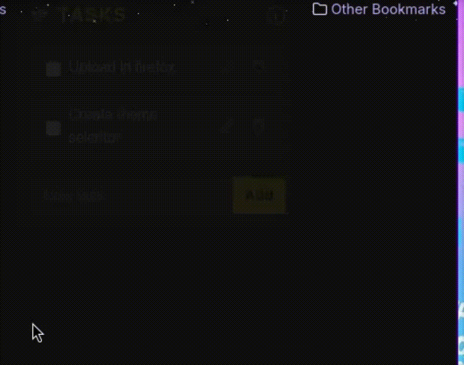

# FasttasK

FasttasK is a lightweight extension for Edge/Firefox that lets you keep a quick, distraction-free local task list.

## Features

- Task list with checkboxes.
- Automatic saving in the browser (offline support).
- Multilanguage (ES/EN).

## Installation

1. Download the code or clone the repo.
2. Open Edge/Firefox in extension developer mode.
3. Load the folder as an "Unpacked extension".
4. Done! You’ll see the ilbeol icon in your toolbar.

## Security

- Requires no permissions beyond `storage`.
- Does not access your tabs or browsing history.
- Open source so anyone can review it.

## Screenshots

### Task list in action

### Example with drag & drop

## Contributing

If you have ideas or improvements:

- Fork the repo and create a pull request.
- Or open an issue on GitHub.

## License

MIT License
